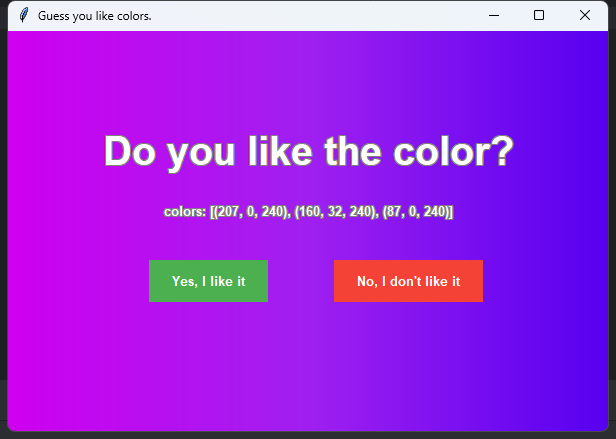
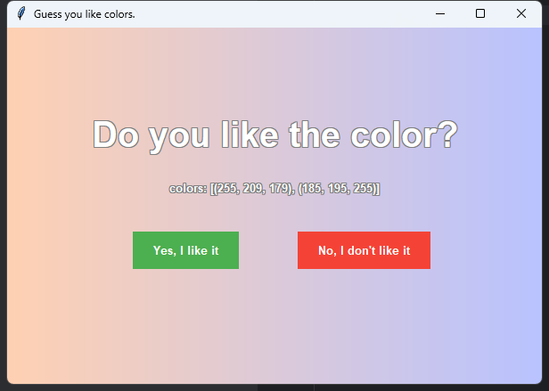

# Project Name
Guess Your Favorite Colors

# Project Description
Generate color combinations based on three dimensions: color system, saturation, and color matching. Then adjust preferences through yes/no buttons.

# Content

Simply click yes or no. After several clicks, it becomes increasingly accurate at guessing your favorite colors.

# Configuration Files

## 1. Preference Configuration

**File:** `src/users/myUser.json`

**Persistent preference tracking:**
- Initial value: 100
- Each yes/no click modifies corresponding scores

**Dimensions tracked:**
1. **Color System** (Red, Orange, Yellow, Green, Aqua, Blue, Purple)
2. **Saturation** (High, Medium, Low) 
3. **Color Matching** (Monochromatic, Analogous, Complementary, Triadic)

## 2. Color Configuration

**File:** `src/colorConfig.py`

**Combines color system and saturation to form a color table:**

🔴 **Red Color System**
Saturation | RGB Values | Color Preview
-----------|------------|--------------
High Saturation | (255, 179, 191) | 

Medium Saturation | (255, 179, 179) | 

Low Saturation | (255, 242, 242) | 

🟠 **Orange Color System**
Saturation | RGB Values | Color Preview
-----------|------------|--------------
High Saturation | (255, 209, 179) | 

Medium Saturation | (255, 223, 204) | 

Low Saturation | (255, 242, 230) | 

🟡 **Yellow Color System**
Saturation | RGB Values | Color Preview
-----------|------------|--------------
High Saturation | (255, 247, 204) | 

Medium Saturation | (255, 249, 204) | 

Low Saturation | (255, 252, 242) | 

🟢 **Green Color System**
Saturation | RGB Values | Color Preview
-----------|------------|--------------
High Saturation | (219, 255, 237) | 

Medium Saturation | (234, 255, 242) | 

Low Saturation | (231, 255, 239) | 

🔵 **Aqua Color System**
Saturation | RGB Values | Color Preview
-----------|------------|--------------
High Saturation | (204, 255, 247) | 

Medium Saturation | (217, 255, 255) | 

Low Saturation | (217, 255, 255) | 

🔷 **Blue Color System**
Saturation | RGB Values | Color Preview
-----------|------------|--------------
High Saturation | (204, 229, 255) | 

Medium Saturation | (220, 229, 255) | 

Low Saturation | (217, 217, 255) | 

🟣 **Purple Color System**
Saturation | RGB Values | Color Preview
-----------|------------|--------------
High Saturation | (160, 32, 240) | 

Medium Saturation | (181, 126, 220) | 

Low Saturation | (255, 229, 255) | 

# Scoring System

- **Click YES:** Increase score
  - **Upper limit:** Average of other values in the same dimension × 1.5
    
- **Click NO:** Decrease score
  - **Lower limit:** 25
    
- **Set upper and lower limits:** To give other low-scoring options probability space to appear, adding more freshness
    
- **Decrease points more than increase points:** To quickly eliminate disliked factors