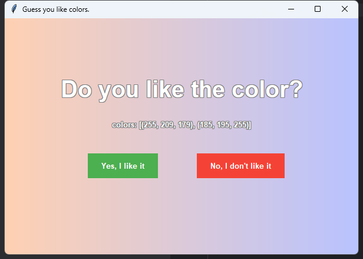

# 项目名称
猜你喜欢颜色
# 项目描述
根据色系、饱和度、色彩匹配三个维度组合出颜色，再通过按钮yes或no，改变偏好
# 内容

只需点击yes或no，点击数次就越来越准，猜出你喜爱的颜色

# 配置文件
1.记录喜好配置

   src/users/myUser.json

   一直记录喜好

      初始值为100
      每次点击yes或no，就会改变对应的分数
    
      分别有\
      1.色系（红、橙、黄、绿、水蓝、蓝、紫）\
      2.饱和度（高、中、低）\
      3.色彩匹配（单色系、邻色、互补色、三色）

2.颜色配置

   src/colorConfig.py

   结合色系和饱和度，组成一个颜色表格
   
🔴 红色系
饱和度	RGB值	颜色预览\
高饱和度	(255, 179, 191)	

中饱和度	(255, 179, 179)	

低饱和度	(255, 242, 242)	

🟠 橙色系
饱和度	RGB值	颜色预览\
高饱和度	(255, 209, 179)	

中饱和度	(255, 223, 204)	

低饱和度	(255, 242, 230)	

🟡 黄色系
饱和度	RGB值	颜色预览\
高饱和度	(255, 247, 204)	

中饱和度	(255, 249, 204)	

低饱和度	(255, 252, 242)	

🟢 绿色系
饱和度	RGB值	颜色预览\
高饱和度	(219, 255, 237)	

中饱和度	(234, 255, 242)	

低饱和度	(231, 255, 239)	

🔵 水蓝色系
饱和度	RGB值	颜色预览\
高饱和度	(204, 255, 247)	

中饱和度	(217, 255, 255)	

低饱和度	(217, 255, 255)	

🔷 蓝色系
饱和度	RGB值	颜色预览\
高饱和度	(204, 229, 255)	

中饱和度	(220, 229, 255)	

低饱和度	(217, 217, 255)	

🟣 紫色系
饱和度	RGB值	颜色预览\
高饱和度	(160, 32, 240)	

中饱和度	(181, 126, 220)	

低饱和度	(255, 229, 255)	

# 得分
    点击yes，加分\
    但加分有上限，上限为 同维度的其它值的平均值*1.5
    
    点击no，减分\
    但减分有下限，下限为25
    
    设置上下限，为了让其他低分的有概率的表现空间，多点新鲜感
    
    减分比加分多，为了尽快去掉不喜欢的因素